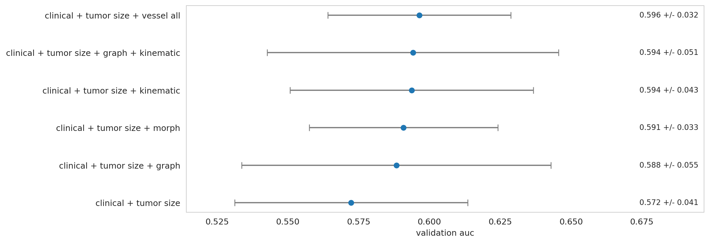

# Vascular Networks for Graphical Understanding And Response Detection (vanguard)

## Project Background

A major challenge in breast cancer care is figuring out whether treatment is working early enough to change course. Standard imaging measures such as tumor shrinkage often do not change until weeks or months into therapy. That delay can leave patients on an ineffective regimen for too long.

This project studies blood vessels around the tumor as a possible earlier signal of response. Tumors depend on nearby vessels for oxygen and nutrients, and those vessels can change during treatment. Breast dynamic contrast-enhanced MRI (DCE-MRI) is useful here because it shows both anatomy and how contrast moves through tissue over time.

Our central idea is to turn the vessel network into something we can measure more directly. We extract vessel centerlines, convert them into graphs, summarize the graph near the tumor, and use those summaries for pathologic complete response (pCR) modeling together with clinical and radiomics features.

## Project Goals

- Build a pipeline that turns breast MRI vessel segmentations into centerlines and graph representations.
- Extract vessel features that describe size, shape, connectivity, and contrast behavior near the tumor.
- Train and evaluate pCR models using clinical, vessel, and radiomics inputs.
- Measure which vessel feature groups appear to add signal beyond clinical and tumor-size baselines.

## Team

- Bella Summe
- Julia Luo
- Jose Cardona Arias
- Rebecca Wu

## Installation

Install micromamba once:

```bash
curl -Ls https://micro.mamba.pm/api/micromamba/linux-64/latest | tar -xvj bin/micromamba
./bin/micromamba shell init -s bash -r ~/micromamba
source ~/.bashrc
micromamba config append channels conda-forge
```

Set up the repository once:

```bash
micromamba config prepend channels conda-forge
micromamba config set channel_priority strict
git clone --recursive git@github.com:dsi-clinic/vanguard.git
cd vanguard
micromamba env create -y -n vanguard -f environment.yml
micromamba activate vanguard
```

Update an existing environment:

```bash
micromamba activate vanguard
micromamba env update -y -n vanguard -f environment.yml
```

Clone with `--recursive` so the segmentation submodule is available.

## Data

### MAMA-MIA Dataset

This project uses the MAMA-MIA breast cancer MRI dataset. It combines 1,506 patients across four collections:

- I-SPY1
- I-SPY2
- NACT-Pilot
- Duke-Breast-Cancer-MRI

Relevant inputs for this repository:

- multi-timepoint breast DCE-MRI volumes
- expert 3D tumor segmentations
- harmonized clinical variables, including pCR labels

References:

- dataset page: <https://github.com/LidiaGarrucho/MAMA-MIA>
- reference: Garrucho et al., Synapse `syn60868042`

On the DSI cluster, the configs in this repo default to shared paths under `/net/projects2/vanguard/...`. Treat those as editable defaults. If your paths differ, change the YAML config before running anything.

## Repository Structure

This repository has four main workflows.

- `segmentation/`
  - runs the vessel-segmentation models that produce the binary vessel masks used downstream
- `graph_extraction/`
  - turns vessel masks into exam-level centerlines, graphs, vessel summaries, and tumor-focused feature JSONs
- `train_tabular.py`
  - trains tabular pCR models from clinical, vessel, and radiomics feature tables
- `radiomics/`
  - separate radiomics-only modeling workflow

Supporting pieces:

- `features/`
  - canonical definitions of the five modeling blocks: `clinical`, `tumor_size`, `morph`, `graph`, and `kinematic`
- `train_gnn.py`
  - template for a future graph neural network training path that reuses the shared evaluator
- `evaluation/`
  - shared split generation, metrics, result aggregation, and output saving used across model families
- `modeling/`
  - helper scripts for array-parallel ablation jobs
- `configs/`
  - `ispy2.yaml` for standard tabular training
  - `ablation.yaml` for broad feature-block ablations
  - `independent_signal.yaml` for the focused independent-signal matrix
- `slurm/`
  - top-level Slurm submission wrappers for modeling runs
- `results/`
  - compact tracked result summaries
- `analysis/`
  - optional notebooks and lightweight exploratory analyses that are not part of the production pipeline
- `docs/`
  - reference documents that are helpful but not part of the main run path

## Segmentation

Start here:

- [`segmentation/README.md`](segmentation/README.md)
- [`segmentation/slurm/README.md`](segmentation/slurm/README.md)

Typical cohort submission:

```bash
cd segmentation/slurm
./submit_batch_segmentation_array.sh
```

Check these variables before running:

- `IMAGES_DIR`
- `OUTPUT_DIR`
- `BREAST_MODEL`
- `VESSEL_MODEL`

## Graph Extraction

Start here:

- [`graph_extraction/README.md`](graph_extraction/README.md)
- [`graph_extraction/slurm/README.md`](graph_extraction/slurm/README.md)

This repository has one supported graph-extraction pipeline, implemented in `graph_extraction/`. Internally, that pipeline uses the tc4d centerline method.

Single-study run:

```bash
micromamba activate vanguard
python graph_extraction/run_skeleton_processing.py \
  --study-id DUKE_041 \
  --input-dir /net/projects2/vanguard/vessel_segmentations/DUKE \
  --output-dir /net/projects2/vanguard/centerlines_tc4d/studies/DUKE/DUKE_041
```

Feature-only recompute from existing centerline outputs:

```bash
micromamba activate vanguard
python graph_extraction/run_skeleton_processing.py \
  --study-id DUKE_041 \
  --input-dir /net/projects2/vanguard/vessel_segmentations/DUKE \
  --output-dir /net/projects2/vanguard/centerlines_tc4d/studies/DUKE/DUKE_041 \
  --features-only \
  --force-features \
  --strict-qc \
  --no-render-mip
```

## Tabular pCR Modeling

Single training run:

```bash
micromamba activate vanguard
python train_tabular.py --config configs/ispy2.yaml --outdir experiments/debug_run
```

Primary training config:

- [`configs/ispy2.yaml`](configs/ispy2.yaml)

Canonical feature blocks used by the tabular pipeline:

- `clinical`
  - non-imaging case-level and tumor metadata
- `tumor_size`
  - tumor size and local tumor-region vessel burden summaries
- `morph`
  - whole-network morphometry aggregates from the centerline graph
- `graph`
  - tumor-centered structural graph features
- `kinematic`
  - tumor-centered dynamic vessel features over time

The code definitions for those blocks live in [`features/`](features).

Before running on a new system, review these config fields:

- `data_paths.centerline_root`
- `data_paths.tumor_mask_root`
- `data_paths.patient_info_dir`
- `data_paths.clinical_excel`
- `data_paths.labels_csv`

## Evaluation Framework

The `evaluation/` package is the shared comparison layer for this repo. It creates train/validation splits, computes metrics, saves fold outputs, and keeps the output format consistent across different model families.

Current users:

- `train_tabular.py`
  - tabular clinical, vessel, and radiomics models
- `train_gnn.py`
  - scaffold for a future GNN runner that should reuse the same split logic and saved-output format

Start here:

- [`evaluation/README.md`](evaluation/README.md)

## Independent-Signal Matrix

This experiment asks a practical question: after accounting for clinical variables and tumor size, do the vessel feature groups still help?

Config:

- [`configs/independent_signal.yaml`](configs/independent_signal.yaml)

How to modify the experiment:

- edit `ablation_arms` in [`configs/independent_signal.yaml`](configs/independent_signal.yaml) to change which block combinations are tested
- edit `baseline_arm_name` in the same file if you want deltas reported against a different reference arm
- keep the canonical block names:
  - `clinical`
  - `tumor_size`
  - `morph`
  - `graph`
  - `kinematic`

Recommended Slurm submission:

```bash
cd slurm
./submit_independent_signal_matrix_array.sh
```

Outputs:

- `experiments/<run_name>/ablation_summary.csv`
- `experiments/<run_name>/ablation_fold_auc.csv`
- `experiments/<run_name>/ablation_auc_summary.png`

Current tracked checkpoint:

- [`results/independent_signal_q3_summary.csv`](results/independent_signal_q3_summary.csv)
- [`results/independent_signal_q3_auc_summary.png`](results/independent_signal_q3_auc_summary.png)

Current result summary:

- baseline `clinical + tumor size`: `0.572 +/- 0.041`
- `+ morph`: `0.591 +/- 0.033`
- `+ graph`: `0.588 +/- 0.055`
- `+ kinematic`: `0.594 +/- 0.043`
- `+ graph + kinematic`: `0.594 +/- 0.051`
- `+ all vessel blocks`: `0.596 +/- 0.032`

Interpretation:

- all three vessel families improved mean AUC over the `clinical + tumor size` baseline in this rerun
- the best mean result came from the full vessel block
- the gains are modest, so future work should focus on more stable feature definitions and cleaner selection within each block

Tracked q3 summary figure:



## Radiomics

Radiomics is maintained as a separate modeling workflow.

- [`radiomics/README.md`](radiomics/README.md)

## Analysis Utilities

Optional exploratory notebooks live under:

- [`analysis/`](analysis)

Optional graph-extraction analysis helpers live under:

- [`graph_extraction/analysis/`](graph_extraction/analysis)

## Running On The Cluster

- Use the `vanguard` micromamba environment for Python commands.
- Use the headnode only for editing, inspection, submission, and log review.
- Submit non-trivial extraction and modeling jobs through Slurm.
- Treat shared cluster paths in YAML files as editable defaults.

## Additional Documentation

- [`docs/data_policy.md`](docs/data_policy.md)
- [`docs/resources.md`](docs/resources.md)
- [`docs/workflow.md`](docs/workflow.md)
