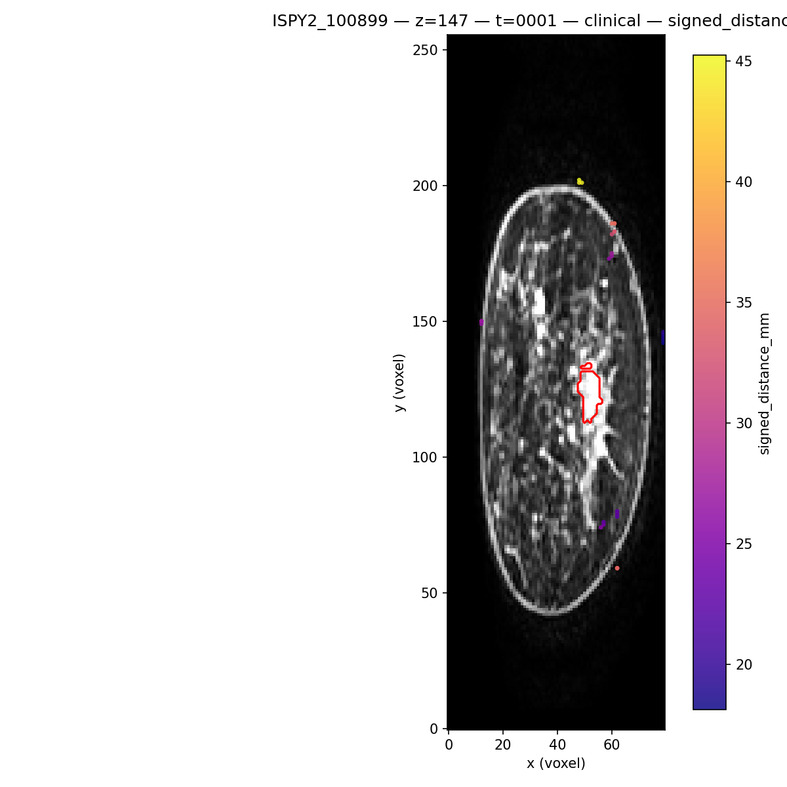
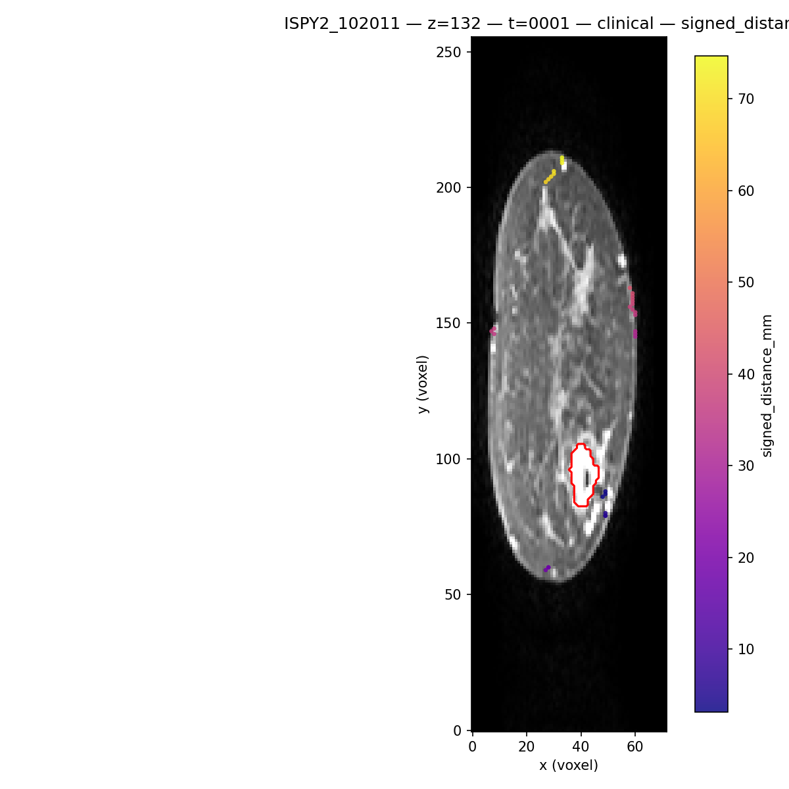
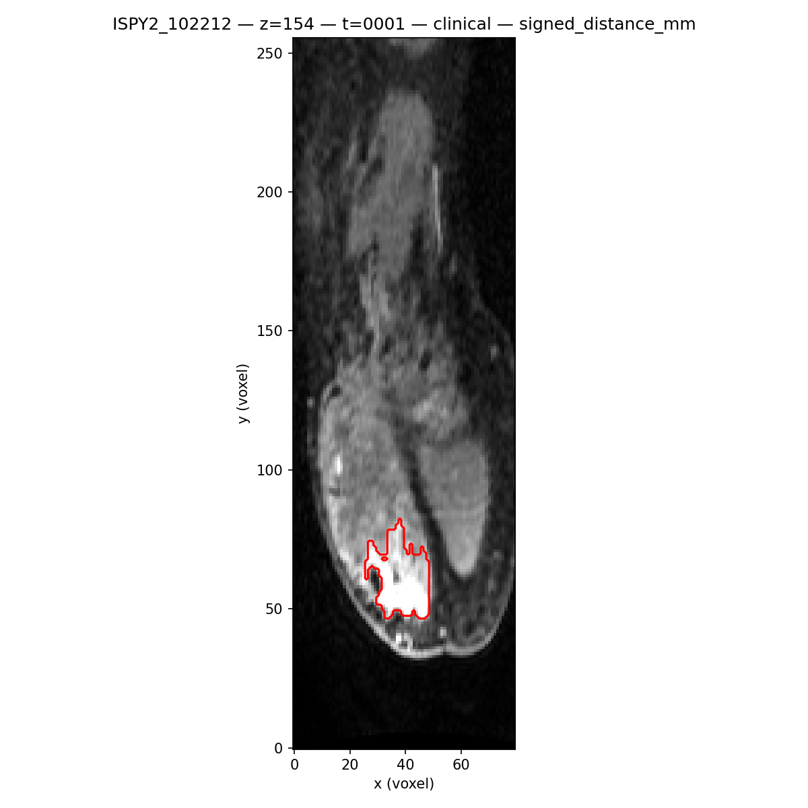
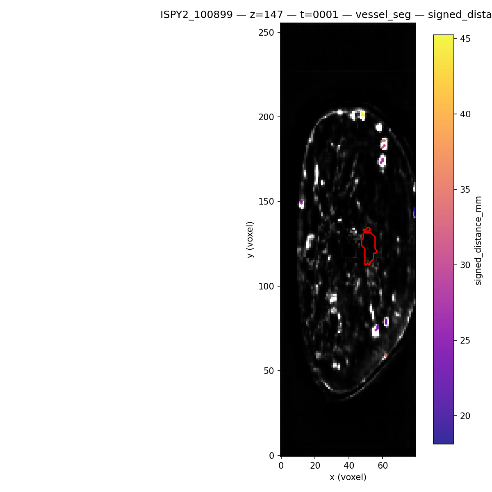

# Deep Sets point sets and point features (issue #119)

Design note for **better tumor-local point sets and point features** on the existing Deep Sets path. Scope here is documentation, path conventions, and **spatial alignment QA** figures—not changes to model architecture or training code.

Related code:

- [`build_deepsets_dataset.py`](../../build_deepsets_dataset.py) — builds one point set per case and the manifest
- [`deepsets_data.py`](../../deepsets_data.py) — loads serialized point tensors for training
- [`train_deepsets.py`](../../train_deepsets.py) — Deep Sets training entrypoint
- [`graph_extraction/README.md`](../../graph_extraction/README.md) — upstream centerline / graph outputs
- [`slurm/submit_deepsets_pipeline.sh`](../../slurm/submit_deepsets_pipeline.sh) and [`slurm/README.md`](../../slurm/README.md) — Slurm-backed dataset build and train

---

## 1. Audit: current builder and training contract

### Per-point payload (serialized `.pt`)

Each case file is a `dict` with at least:

| Field | Meaning |
|--------|---------|
| `x` | `float32` tensor of shape `[num_points, num_features]`. Defaults to **only** `curvature_rad`; expanded point features are opt-in via config. |
| `y` | Scalar label tensor. |
| `case_id` | String study identifier. |
| `feature_names` | List aligned with columns of `x` (default `["curvature_rad"]`, or the configured `feature_toggles.deepsets_point_features`). |
| `local_radius_mm`, `tumor_equiv_radius_mm` | Tumor-local inclusion radius metadata (case-level). |
| `num_points` | Number of rows in `x`. |
| `used_fallback_nearest_points` | Whether the nearest-64 fallback ran when no points passed the distance filter. |

**Not stored per point unless opted in:**

- Signed distance to the tumor boundary (mm) is always used to **filter** points (`signed_distance_mm <= local_radius_mm`) and for fallback ordering. It is written into `x` only when `signed_distance_tumor_mm` is requested.
- Voxel `(x, y, z)` coordinates are **not** saved; order follows `numpy.argwhere` on the full skeleton mask, then the inclusion rule.

### Manifest (`deepsets_manifest.csv`)

Written by the builder with columns:

`case_id`, `set_path`, `label`, `dataset`, `num_points`, `local_radius_mm`, `tumor_equiv_radius_mm`, `used_fallback_nearest_points`.

Training requires `case_id`, `set_path`, and the label column from config (`data_paths.deepsets_label_column`, default `label`).

### Upstream artifacts (documented in graph extraction) not used by the Deep Sets builder

The default builder reads the exam skeleton mask (`{case_id}_skeleton_4d_exam_mask.npy` under `centerline_root / dataset / case_id`). It also reads `{case_id}_skeleton_4d_exam_support_mask.npy` only when `local_vessel_radius_mm` is requested. It does **not** currently consume:

- `{case_id}_morphometry.json` — segment-level geometry and graph primitives
- `{case_id}_tumor_graph_features.json` — tumor-centered summaries (shells, topology, kinetics)
- The multi-timepoint inputs used for kinematic features in the graph pipeline (clinical DCE NIfTIs vs vessel-segmentation NPZs, depending on cohort layout)

The builder **does** load the tumor mask and forces **shape agreement** with the skeleton using the same axis-permutation strategy as [`load_tumor_mask_zyx`](../../features/tumor_size.py).

### Slurm

Full cohort dataset builds should run **via Slurm**, not on the headnode. Use [`slurm/submit_deepsets_pipeline.sh`](../../slurm/submit_deepsets_pipeline.sh) as described in [`slurm/README.md`](../../slurm/README.md).

---

## 2. Canonical `/net` paths (cluster layout)

These paths were checked on the shared filesystem; they match [`configs/deepsets_ispy2.yaml`](../../configs/deepsets_ispy2.yaml) defaults for ISPY2.

| Path | Role |
|------|------|
| `/net/projects2/vanguard/MAMA-MIA-syn60868042/images/<case_id>/` | **Clinical DCE** phases: `{case_id}_0000.nii.gz`, `_0001`, … (`_0000` = pre-contrast in this layout). |
| `/net/projects2/vanguard/MAMA-MIA-syn60868042/segmentations/expert` | Tumor masks `{case_id}.nii.gz` (not DCE). |
| `/net/projects2/vanguard/vessel_segmentations/ISPY2/<case_id>/images/` | **`{case_id}_????_vessel_segmentation.npz`** — time series fed to tc4d; **same lineage** as the saved exam skeleton. |
| `/net/projects2/vanguard/centerlines_tc4d/studies/ISPY2/<case_id>/` | Skeleton, support, morphometry, tumor graph JSONs. |
| `/net/projects2/vanguard/centerlines` | Legacy `.vtp` centerlines (not used for this Deep Sets path). |
| `/net/projects2/vanguard/centerlines_4d` | Alternate centerline layout (not DCE). |
| `/net/projects2/vanguard/Duke-Breast-Cancer-MRI-Supplement-v3` | DUKE supplement data (different cohort). |

**Alignment script defaults** (see [`scripts/deepsets_alignment_check.py`](../../scripts/deepsets_alignment_check.py)):

- `--dce-root` → `/net/projects2/vanguard/MAMA-MIA-syn60868042/images`
- Clinical phase file: `{dce_root}/{case_id}/{case_id}_{time:04d}.nii.gz`
- `--use-vessel-segmentation-phases` with `--vessel-segmentation-root` → `/net/projects2/vanguard/vessel_segmentations/ISPY2` for NPZ phases under `<case_id>/images/`.

---

## 3. Opt-in and candidate point features

| Feature name | Short description | Extra inputs vs today | Computable from existing on-disk artifacts? |
|--------------|-------------------|------------------------|-----------------------------------------------|
| `signed_distance_tumor_mm` | Signed distance to tumor boundary (mm) | Tumor mask + spacing (already in builder) | Yes (persist or recompute) |
| `abs_distance_tumor_mm` | `abs(signed_distance_tumor_mm)` | Same | Yes |
| `inside_tumor` | Indicator `signed_distance < 0` | Same | Yes |
| `shell_bin` / `shell_onehot` | Distance-to-boundary shells (mm bins) | Shell definitions (e.g. mirror graph / tumor_size shells) | Yes |
| `offset_from_tumor_centroid_norm` | Normalized vector from tumor centroid to point | Tumor COM + skeleton indices | Yes |
| `local_vessel_radius_mm` | EDT radius from support mask | `{case_id}_skeleton_4d_exam_support_mask.npy` | Yes (file sits next to skeleton) |
| `skeleton_node_degree` | 26-neighborhood degree on skeleton | Skeleton only | Yes |
| `is_endpoint` / `is_chain` / `is_junction` | Flags for degree 1 / 2 / ≥3 | Skeleton only | Yes |
| `direction_to_tumor_centroid` | Unit vector from point to centroid (3 channels) | Tumor mask + skeleton | Yes |
| `curvature_rad` | Current shipped feature | Skeleton + spacing | Yes |
| `dce_intensity_*` | Intensities or simple wash metrics at each point | Registered **clinical** DCE **or** vessel NPZ time series | Needs chosen source + alignment QA |
| `graph_segment_radius`, tortuosity-style locals | Map voxels to morphometry segments | `{case_id}_morphometry.json` + graph primitives | Needs JSON + join logic |

**Dynamic features:** clinical DCE and vessel NPZs answer **different** questions—clinical overlays show anatomy; NPZ phases are **grid-identical** to tc4d inputs. Any new feature should state which grid it uses.

Opt-in expanded point-feature example:

```yaml
feature_toggles:
  deepsets_point_features:
    - curvature_rad
    - signed_distance_tumor_mm
    - abs_distance_tumor_mm
    - inside_tumor
    - skeleton_node_degree
    - is_endpoint
    - is_chain
    - is_junction
    - offset_from_tumor_centroid_norm_x
    - offset_from_tumor_centroid_norm_y
    - offset_from_tumor_centroid_norm_z
    - direction_to_tumor_centroid_x
    - direction_to_tumor_centroid_y
    - direction_to_tumor_centroid_z
    - local_vessel_radius_mm
```

---

## 4. Spatial alignment QA

Serialized Deep Sets `.pt` files do not store voxel coordinates. QA overlays **reload** the skeleton `.npy` and tumor mask with the same shape-matching rules as the builder, then sample the chosen volume at the same indices.

### How to regenerate figures

From the repo root, with the **vanguard** environment (`micromamba activate vanguard` on the cluster):

```bash
export MPLCONFIGDIR=/tmp/$USER-mpl  # optional; avoids home cache permission issues
PYTHONPATH=. python scripts/deepsets_alignment_check.py \
  --case-ids ISPY2_100899,ISPY2_102011,ISPY2_102212 \
  --time-index 1
```

Vessel-segmentation (tc4d input grid) example:

```bash
PYTHONPATH=. python scripts/deepsets_alignment_check.py \
  --case-ids ISPY2_100899 \
  --time-index 1 \
  --use-vessel-segmentation-phases
```

Outputs default to `docs/deepsets_issue119/figures/`.

### Clinical DCE overlays (phase `0001`, signed distance coloring)

Axial slice at **z = index of maximum in-slice tumor area**; skeleton points within ±1 slice; tumor contour in red.







### Vessel segmentation overlay (same case, same z; NPZ phase 0001)



### Verdict

For **ISPY2_100899**, **ISPY2_102011**, and **ISPY2_102212** at post-contrast index `0001`:

- NIfTI DCE volumes **match the skeleton grid** after the same three axis permutations used for the tumor mask in training data prep.
- On the chosen axial slices, **skeleton points fall on enhancing vessel structure** near the tumor contour, without obvious global translation between mask contour and perfused tissue.

We therefore treat **clinical DCE alignment with saved skeleton and expert tumor mask as trustworthy for ISPY2** under the current preprocessing assumptions. Any new DCE-sampled feature should still re-run this check when adding cohorts or changing mask or centerline pipelines.

---

## 5. Out of scope (this note)

- Changing [`deepsets_model.py`](../../deepsets_model.py) architecture
- Adding DCE/NPZ time-series sampled point features
- Joining point rows back to morphometry segments for segment-level locals
