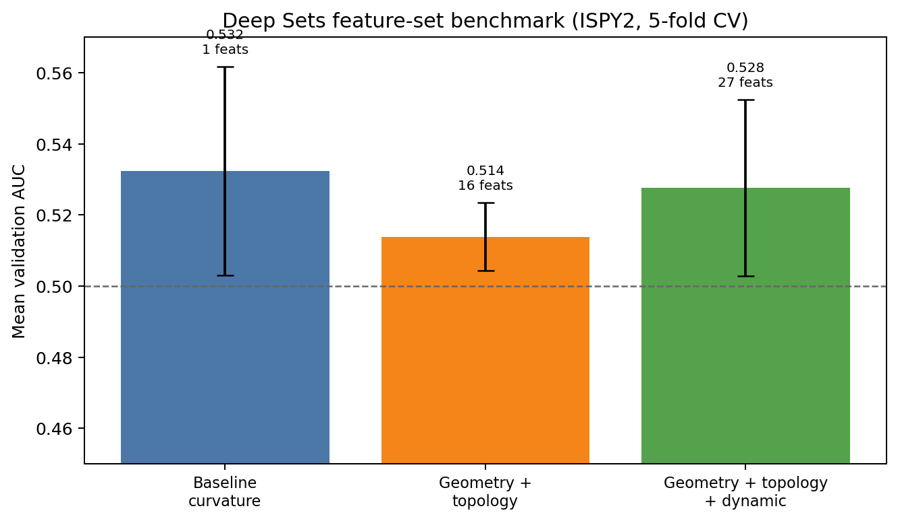

# Deep Sets point-feature benchmark (issue #120)

## Training hyperparameters

Use the same `model_params` block in all three configs (already matched in the
pinned YAMLs under `configs/deepsets_ispy2_pointfeat_*.yaml`): batch size, epochs,
hidden width, layers, dropout, learning rate, weight decay, pooling, and
tumor-local radius settings.

## Building datasets

For each arm, point `CONFIG` at the matching YAML and use a **separate**
`OUT_ROOT` so manifests and `.pt` sets never mix feature regimes.

| Arm | Config path | Suggested `OUT_ROOT` |
|-----|-------------|----------------------|
| Baseline (curvature only) | `configs/deepsets_ispy2_pointfeat_baseline.yaml` | `experiments/deepsets_ispy2_pointfeat_baseline` |
| Geometry + topology | `configs/deepsets_ispy2_pointfeat_geom_topo.yaml` | `experiments/deepsets_ispy2_pointfeat_geom_topo` |
| Geometry + topology + dynamic | `configs/deepsets_ispy2_pointfeat_geom_topo_dynamic.yaml` | `experiments/deepsets_ispy2_pointfeat_geom_topo_dynamic` |

Run `build_deepsets_dataset.py` (and `merge_deepsets_manifest.py` if sharded),
then inject `data_paths.deepsets_manifest_csv` into a runtime YAML the same way
`slurm/submit_deepsets_pipeline.sh` does, and run `train_deepsets.py`.

Optional: `scripts/benchmark_deepsets_feature_sets.sh` submits or documents the
three `(CONFIG, OUT_ROOT)` pairs in one loop.

## Results

| Config path | Mean validation AUC (or primary metric) | Notes |
|-------------|------------------------------------------|-------|
| `configs/deepsets_ispy2_pointfeat_baseline.yaml` | `0.5323` | From `experiments/deepsets_ispy2_pointfeat_baseline/train/deepsets_ispy2_pointfeat_baseline_20260421_125620/deepsets_ispy2_pointfeat_baseline/metrics.json` (`aggregated_metrics.auc.mean`; std `0.0294`; `n_features=1`). |
| `configs/deepsets_ispy2_pointfeat_geom_topo.yaml` | `0.5138` | From `experiments/deepsets_ispy2_pointfeat_geom_topo/train/deepsets_ispy2_pointfeat_geom_topo_20260421_130516/deepsets_ispy2_pointfeat_geom_topo/metrics.json` (`aggregated_metrics.auc.mean`; std `0.0096`; `n_features=16`). |
| `configs/deepsets_ispy2_pointfeat_geom_topo_dynamic.yaml` | `0.5277` | Recovered by rerunning training against the existing dynamic manifest with Slurm job `840037`: `experiments/deepsets_ispy2_pointfeat_geom_topo_dynamic_existing_manifest_train/deepsets_ispy2_pointfeat_geom_topo_dynamic_20260504_184523/deepsets_ispy2_pointfeat_geom_topo_dynamic/metrics.json` (`aggregated_metrics.auc.mean`; std `0.0248`; `n_features=27`). |

Metrics are written under the training run directory (see
`evaluation/evaluator.py` `save_results` output for
`experiment_setup.name`).

The chart source table is
`docs/deepsets_issue120_figures/feature_set_benchmark_summary.csv`.

## Interpretation

In this fixed-training comparison, geometry+topology underperformed the baseline
(`0.5138` vs `0.5323` mean validation AUC), so these added point features did
not improve the baseline by themselves. Adding dynamic features recovered most
of that drop (`0.5277` mean validation AUC) and improved over geometry+topology,
but it still did not beat the curvature-only baseline in this run.

## Smoke build/merge path confirmation

- Slurm logs indicate successful build shards and merge for the original fixed
  arm runs:
  - dynamic build shards: `logs/deepsets-build-816757-*.err` (all complete);
  - merge: `logs/deepsets-merge-816755.err` (empty error log; success path).
- Local smoke merge also succeeded on current artifacts:
  - `python merge_deepsets_manifest.py --output-dir /home/lunad/vanguard/experiments/deepsets_ispy2_pointfeat_geom_topo_dynamic`
  - output present: `experiments/deepsets_ispy2_pointfeat_geom_topo_dynamic/deepsets_manifest.csv`.
- The dynamic training metric above was recovered without rebuilding the full
  dataset by submitting train-only Slurm job `840037` against
  `/home/lunad/vanguard/experiments/deepsets_ispy2_pointfeat_geom_topo_dynamic/deepsets_runtime_config.yaml`.
- A payload contract spot check on
  `experiments/deepsets_ispy2_pointfeat_geom_topo_dynamic/sets/ISPY2_100899.pt`
  confirmed `x.shape == (846, 27)`, `len(feature_names) == 27`,
  `point_feature_set == "geometry_topology_dynamic"`, and
  `kinetic_timepoint_count == 6`.
- A full dynamic rebuild was also started in
  `experiments/deepsets_ispy2_pointfeat_geom_topo_dynamic_issue120_rerun_20260504`.
  Initial Slurm build array `839719` completed six shards but shards 0 and 1 hit
  the 2-hour build limit; retry array `839943` resubmitted only those two shards
  with a 4-hour limit, followed by merge `839944` and train `839945`.
