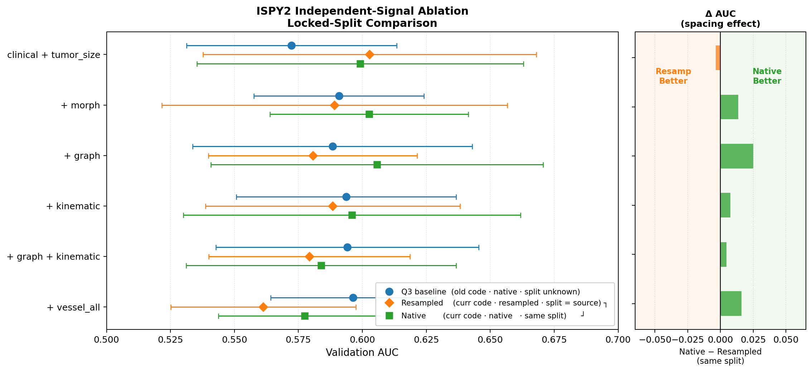
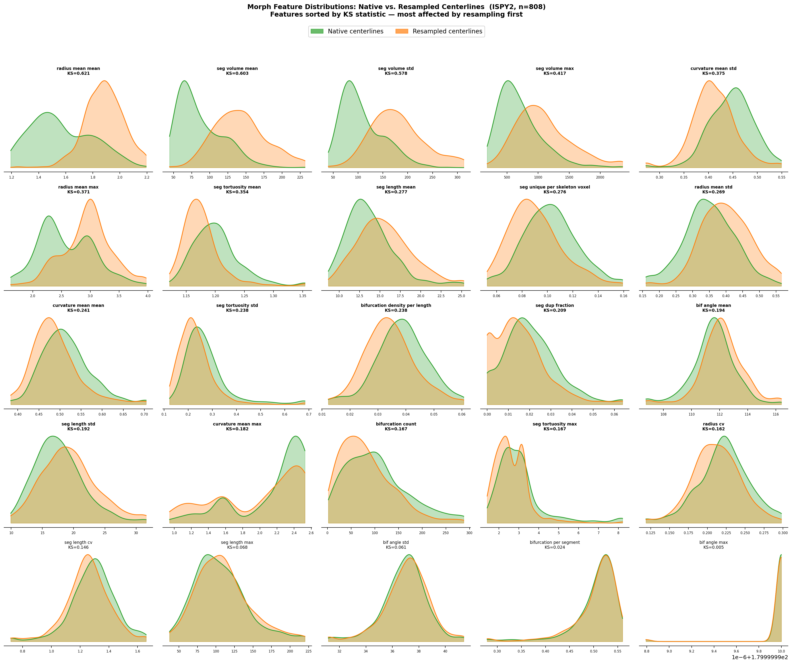

# Resampling Effect Analysis — ISPY2 Vessel Features

**Date:** 2026-06-30  
**Question:** Does resampling MRI to a common voxel spacing (DUKE mode: 0.7×0.7×1.0 mm) meaningfully change the vessel graph features extracted from the centerlines, and does this affect pCR prediction AUC?

---

## Experiment Design

Three runs of the same 6-arm logistic regression ablation (ISPY2, n=808, 5-fold CV):

| Run | Code | Centerlines | Split |
|-----|------|-------------|-------|
| Q3 baseline | old | native spacing | free (random_state=42) |
| Resampled | current | resampled to DUKE spacing | free (random_state=42) — *source of locked split* |
| Native locked | current | native spacing | **same split as resampled** |

The native locked run locks the fold assignment to exactly what the resampled run used, so the only variable between those two is the centerline source. Any AUC delta is attributable to the spacing change alone.

---

## AUC Comparison (same split)

| Arm | Resampled | Native locked | Δ (native − resamp) |
|-----|-----------|---------------|---------------------|
| clinical + tumor_size | 0.603 | 0.599 | −0.004 |
| + morph | 0.589 | 0.603 | **+0.013** |
| + graph | 0.581 | 0.606 | **+0.025** |
| + kinematic | 0.588 | 0.596 | **+0.008** |
| + graph + kinematic | 0.579 | 0.584 | **+0.005** |
| + vessel_all | 0.561 | 0.577 | **+0.016** |

Native locked beats resampled on every vessel arm. The clinical-only arm is essentially tied (−0.004), confirming the degradation is specific to vessel features, not a global shift.

---

## Morph Feature Distributions: Native vs. Resampled

The grid below shows each morphology feature's distribution at native (green) vs. resampled (orange) spacing, sorted by KS statistic (most affected first).

---

## Which Features Shifted Most?

Ranked by two-sample KS statistic (0 = identical distributions, 1 = completely separated):

| Feature | KS | Native median | Resampled median | Direction |
|---|---|---|---|---|
| `radius_mean_mean` | **0.621** | 1.53 | 1.89 | resamp → larger radius |
| `seg_volume_mean` | **0.603** | 77.6 | 139.7 | resamp → larger volume |
| `seg_volume_std` | **0.578** | 96.8 | 173.7 | resamp → more volume spread |
| `seg_volume_max` | 0.417 | 625 | 1021 | resamp → larger max segment |
| `curvature_mean_std` | 0.375 | 0.450 | 0.410 | resamp → less curvature spread |
| `radius_mean_max` | 0.371 | 2.48 | 3.00 | resamp → larger max radius |
| `seg_tortuosity_mean` | 0.354 | 1.198 | 1.171 | resamp → less tortuous |
| `seg_length_mean` | 0.277 | 13.2 | 15.2 | resamp → longer segments |
| `seg_unique_per_skeleton_voxel` | 0.276 | 0.102 | 0.088 | resamp → lower density |
| `bifurcation_count` | 0.167 | 96 | 73 | resamp → fewer bifurcations |

Features least affected (KS < 0.10): `bif_angle_std`, `bifurcation_per_segment`, `bif_angle_max` — angular features are relatively stable under resampling.

---

## Interpretation

### Why do volume and radius features shift so much?

Resampling interpolates the binary vessel segmentation mask to a new voxel grid before centerline extraction. The target voxel spacing (0.7×0.7×1.0 mm) is larger than the native spacing for most ISPY2 patients. Interpolation of a binary mask tends to **smooth and thicken** thin tubular structures: small vessels that were 1–2 voxels wide at native resolution get blurred into wider, higher-volume tubes. This directly inflates `radius_mean` and `seg_volume` measurements.

Segment length increases for the same reason — centerlines traced through thicker vessel representations follow slightly different paths with fewer short dead-end branches, producing longer average segment lengths.

The drop in `bifurcation_count` (median 96 → 73) is consistent: resampling merges small branch points that were distinct at native resolution, reducing the apparent branching complexity of the network.

### Why does this hurt AUC?

The resampled vessel features no longer reflect true vascular geometry — they partially reflect the resampling artifact. Features like `radius_mean` and `seg_volume` that carry genuine biological signal (larger tumors have denser, more irregular vasculature) get contaminated with a spacing-dependent offset. This reduces their discriminative power between pCR-positive and pCR-negative patients.

### What does this suggest?

1. **Prefer native centerlines** for downstream analysis when available. The +0.013 to +0.025 AUC gain on vessel arms is meaningful given the overall AUC range.
2. **Spacing-normalised features** (e.g. segment length in mm rather than voxels, or tortuosity which is dimensionless) are more robust — the KS statistics for tortuosity and angle features are much lower than for radius/volume.
3. If resampled centerlines must be used (e.g. for cross-cohort standardisation), consider calibrating radius and volume features against a reference dataset at known native spacing before combining.

---

## Files

| File | Description |
|------|-------------|
| `results/locked_split_auc_comparison.csv` | Full numeric AUC table (all three runs) |
| `results/locked_split_auc_comparison.png` | Three-way AUC visual |
| `results/morph_features_native_vs_resampled.png` | Morph feature distribution grid |
| `scripts/plot_morph_native_vs_resampled.py` | Script that generated the distribution grid |
| `scripts/plot_locked_split_comparison.py` | Script that generated the AUC comparison plot |
| `scripts/extract_resampled_splits.py` | Extracts locked split CSV from a completed run |
| `configs/native_locked_split_ispy2.yaml` | Config for the native locked-split run |
| `/ess/scratch/.../locked_split_resampled_ispy2.csv` | Locked fold assignment (808 patients × val_fold) |
